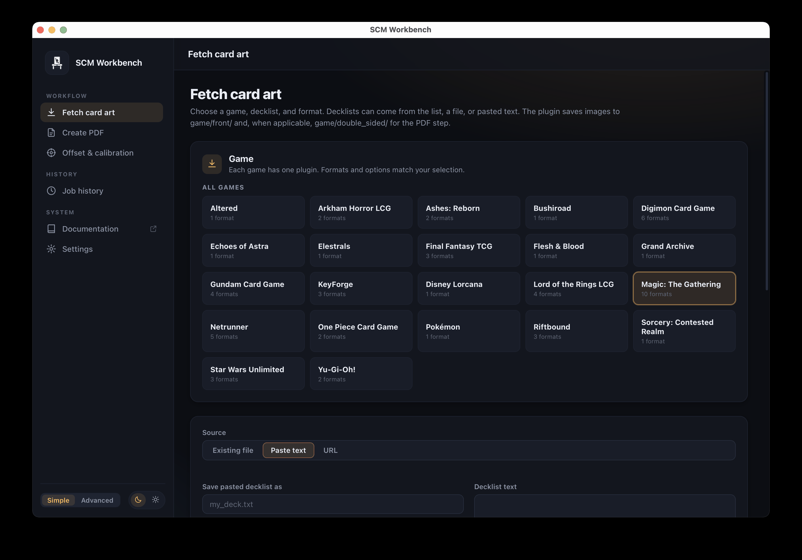

# SCM Workbench

  

SCM Workbench is a desktop app for turning card game decklists into printable PDFs and Silhouette cutting templates.

It runs [silhouette-card-maker](https://github.com/Alan-Cha/silhouette-card-maker) and [scm-extras](https://github.com/Alan-Cha/scm-extras) behind the scenes. You choose options in the app, and Workbench handles the commands, downloads, progress, and files for you. No terminal or Python setup is needed.

None of this would be possible without the excellent work by [Alan Cha](https://github.com/Alan-Cha), thank you!

## Download and install

[Download the latest version from GitHub Releases.](https://github.com/mallen86/scm-workbench/releases/latest) On the release page, choose the file for your computer.

### macOS for Apple silicon (M-series Macs)

The current macOS app is not notarized, so macOS blocks the first launch of every version. Every user follows the same approval steps:

1. Download `scm-workbench-macos.dmg`.
2. Open the DMG and drag **SCM Workbench** onto the **Applications** icon.
3. Eject the DMG, then open **SCM Workbench** from Applications. macOS will block this first attempt.
4. Open **System Settings**, choose **Privacy & Security**, and scroll to the bottom.
5. Click **Open Anyway** for SCM Workbench, confirm the choice, and the app should open.

You only need to do this once. Updates do not require you to repeat these steps. For troubleshooting, see [First run on macOS](docs/macos-first-run.md).

### Windows 64-bit

1. Download `scm-workbench-windows.zip`.
2. Extract the ZIP to a folder.
3. Open **SCM Workbench.exe** from the extracted folder.
4. If Windows SmartScreen appears, choose **More info**, then **Run anyway**.

The Windows version is portable and does not use an installer.

## Your first launch

Workbench downloads the card-making tools and game information it needs. This can take a few minutes, and progress is shown in the app. Keep the window open until it says your workspace is ready.

When setup finishes, choose **Got it. Show me around** for an optional guided tutorial. It walks through fetching card art, choosing card and paper sizes, adding a card back, and creating a PDF. You can stop at any step and replay it later from **Settings > Guided tutorial**.

If setup stops early, use **Retry setup**. Workbench only retries the parts that are not ready.

## Make your first PDF

1. Open **Fetch card art**.
2. Choose your game and provide a decklist. You can select an existing decklist, browse for a file, paste text, or use a supported URL.
3. Start the fetch and wait for the card images to finish downloading.
4. Open **Create PDF**, then choose your card size and paper size.
5. Add a card back image if your cards need one.
6. Check the **First Page Preview**, then choose **Create PDF**.
7. When the job finishes, open the PDF from Workbench. You can also open the matching cutting template when one is available.

> Starting a different deck? Use **Clear card images** on the Fetch card art page first so images from the previous deck are not included in the new PDF.

## Simple and Advanced modes

Workbench starts in **Simple** mode, which keeps the main workflow easy to follow. Use the switch at the bottom of the sidebar to change modes at any time.

- **Simple** shows the everyday steps and the most useful PDF options.
- **Advanced** shows every option, utility, layout reference, and exact command preview.

Your choices and job history stay the same when you switch modes.

## Other useful tools

- **Offset & calibration** helps correct printer alignment for each paper size.
- **Cutting templates** creates or opens matching DXF and `.studio3` files.
- **Job history** keeps earlier runs, results, and the settings used for each job.
- **Sizes & layouts** shows supported card sizes, paper sizes, and cards per page.

## Updates and your files

Workbench checks for stable app updates automatically. In Advanced mode, **Settings > App updates** also offers an explicit opt-in to GitHub prereleases. The beta preference is inactive while using Simple mode, so Simple users always receive stable releases; Advanced users who opt in receive the highest available version across stable and beta releases. Updating replaces the app but leaves your settings, decklists, card images, PDFs, and job history alone.

Use **Settings > Open data folder** if you want to view or back up your Workbench files.

## Help

- Open **Documentation** in the Workbench sidebar for the silhouette-card-maker guide.
- Read [First run on macOS](docs/macos-first-run.md) if the Mac app is blocked or does not finish opening.
- [Join the SCM Discord](https://discord.gg/jhsKmAgbXc) to ask questions and meet other users.
- [Open a GitHub issue](https://github.com/mallen86/scm-workbench/issues) to report a Workbench problem.

## Contributing

Want to run Workbench from source or help improve it? See [CONTRIBUTING.md](CONTRIBUTING.md) for development, testing, packaging, and release instructions.
